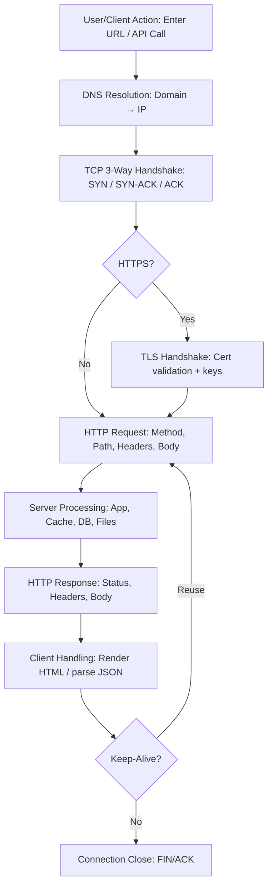

# Networking

## Topologies

## Star Topology

The main premise of a star topology is that devices are individually connected
via a central networking device such as a switch or hub. This topology is the
most commonly found today because of its reliability and scalability — despite
the cost.

## Bus Topology

This type of connection relies upon a single connection known as a **backbone
cable**. This topology is similar to the leaf of a tree in the sense that
devices (leaves) stem from where the branches are on this cable.

Because all data destined for each device travels along the same cable, it is
quickly prone to becoming slow and bottlenecked if devices within the topology
are simultaneously requesting data. This bottleneck also results in very
difficult troubleshooting because it becomes hard to identify which device is
experiencing issues with all data travelling along the same route.

However, bus topologies are one of the easier and more cost-efficient topologies
to set up because of lower expenses, such as cabling or dedicated networking
equipment used to connect these devices.

## Ring Topology

The ring topology (also known as token topology) boasts some similarities.
Devices such as computers are connected directly to each other to form a loop,
meaning there is little cabling required and less dependence on dedicated
hardware such as within a star topology.

A ring topology works by sending data across the loop until it reaches the
destined device, using other devices along the loop to forward the data.
Interestingly, a device will only send received data from another device in this
topology if it does not have any to send itself. If the device has data to send,
it will send its own first before forwarding others’.

Because there is only one direction for data to travel across this topology, it
is fairly easy to troubleshoot any faults that arise. However, this is a double-
edged sword because it isn't an efficient way for data to travel across a
network, as it may have to visit multiple devices before reaching the intended
device.

---

## Subnet

**Subnetting** is the term given to splitting up a network into smaller,
miniature networks within itself. It’s achieved by splitting up the number of
hosts that can fit within the network, represented by a number called a **subnet
mask** (also represented as four bytes/32 bits, 0–255 per octet).

- Home networks are typically a single subnet (unlikely to need more than ~254
  devices).
- Businesses and offices often require multiple subnets for PCs, printers,
  cameras, sensors, etc.

**Benefits of subnetting include:**

- Efficiency
- Security
- Full control

### Common Address Types (Example: 192.168.1.0/24)

| Type            | Purpose                                                                           | Example         |
| --------------- | --------------------------------------------------------------------------------- | --------------- |
| Network Address | Identifies the network and is used to denote its existence.                       | `192.168.1.0`   |
| Host Address    | Identifies a device on the subnet.                                                | `192.168.1.100` |
| Default Gateway | Special host that can send information to another network (often `.1` or `.254`). | `192.168.1.254` |

---

## ARP (Address Resolution Protocol)

Devices have two identifiers: a **MAC address** and an **IP address**. **ARP**
maps these together and stores the results in a local **cache**.

- **ARP Request**: “Who has IP X.X.X.X? Tell me your MAC.”
- **ARP Reply**: “IP X.X.X.X is at MAC xx:xx:xx:xx:xx:xx.”

---

## DHCP (Dynamic Host Configuration Protocol)

**DHCP** dynamically assigns IP addresses to devices on a network.

1. **DHCP Discover** (client → broadcast): “Is there a DHCP server?”
2. **DHCP Offer** (server → client): “Here’s an IP you can use.”
3. (Followed by Request/Ack in full DORA flow.)

---

## OSI Model

The **OSI (Open Systems Interconnection) model** provides a framework for how
devices send, receive, and interpret data.


## 1. Physical

The physical components of hardware used for networking.

- Ethernet cable

## 2. Data Link

Handles **physical addressing**. Receives a packet from the network layer and
adds the **MAC address** of the receiving endpoint. Network Interface Cards
(NICs) have unique MAC addresses.

- Network Interface Card (NIC)

## 3. Network

Where **routing** and **reassembly** take place. Determines the optimal path for
data. Protocols include OSPF and RIP.

- Routing
- IP Addresses

### Public IP Addresses

Public IPs are globally routable and uniquely identify devices on the Internet.
[Public IP Addresses](<https://www.geeksforgeeks.org/computer-networks/what-is->
public-ip-address)

### Private IP Addresses (RFC1918)

- `10.0.0.0/8` → `10.0.0.0 – 10.255.255.255`
- `172.16.0.0/12` → `172.16.0.0 – 172.31.255.255`
- `192.168.0.0/16` → `192.168.0.0 – 192.168.255.255`

Private IPs are non-routable on the Internet and used within local networks.
[Private IP Addresses](<https://www.geeksforgeeks.org/computer-networks/private->
ip-addresses-in-networking/)

## 4. Transport

When data is sent between devices, it follows one of two protocols: **TCP** or
**UDP**.

### TCP

Transmission Control Protocol is a connection-oriented transport protocol.
It uses various mechanisms to ensure reliable data delivery,
sent by the different processes on the networked hosts.
Like UDP, it is a layer 4 protocol.
Being connection-oriented, it requires the establishment of a TCP connection,
before any data can be sent.

A TCP connection is established using what’s called a three-way handshake.

Two flags are used: SYN (Synchronise) and ACK (Acknowledgment).

The packets are sent as follows:

SYN Packet: The client initiates the connection by sending a SYN packet to the server.
This packet contains the client’s randomly chosen initial sequence number.

SYN-ACK Packet: The server responds to the SYN packet with a SYN-ACK packet,
which adds the initial sequence number randomly chosen by the server.

ACK Packet: The three-way handshake is completed as the client sends an ACK packet,
to acknowledge the reception of the SYN-ACK packet.

**Features:**

- Sequencing (numbers each segment)
- Flow control
- Error control
- Congestion awareness

**Applications:**

- Web (WWW)
- Email (SMTP, IMAP/POP via TCP)
- FTP
- SSH
- Some streaming services

**Advantages:**

- Reliable connection
- Ordered delivery
- OS-agnostic operation
- Supports many routing protocols
- Adapts to receiver speed

**Disadvantages:**

- Slower than UDP; more overhead
- Slower start (handshake)
- No native multicast/broadcast
- Sensitive to missing data (head-of-line blocking)

### UDP

User Datagram Protocol allows us to reach a specific process on this target host.
UDP is a simple connectionless protocol that operates at the transport layer,
layer 4. Being connectionless means that it does not need to establish a connection.
UDP does not even provide a mechanism to know that the packet has been delivered.

**Features:**

- Connectionless, low-overhead
- Suitable for multicast
- Used by some routing protocols (e.g., RIP)
- Good for real-time apps

**Applications:**

- Real-time multimedia streaming
- Online gaming
- DNS queries
- Network monitoring
- Multicasting
- Routing updates

**Advantages:**

- No connection setup
- Broadcast/multicast support
- Works across many networks
- Real-time friendly
- Tolerates partial data

**Disadvantages:**

- No delivery acknowledgment
- No sequencing
- Unreliable by design
- Routers may drop on collision/error

## 5. Session

Creates and maintains connections (sessions). Can include **checkpoints** for
efficient recovery and is responsible for closing idle/lost connections.

- Connection checking

## 6. Presentation

Provides **standardization and translation** between application data formats.

- Translator

## 7. Application

Defines the protocols and rules users/applications interact with.

- Data interaction

--

- Layer 1 - Physical Layer

The physical connection between devices;
Such as a wire, and the definition of the binary digits 0 and 1.
 Data transmission can be via an electrical, optical, or wireless signal.
 Consequently, we need data cables or antennas, depending on our physical medium.

- Layer 2 - Data Link Layer

Represents the protocol that enables data transfer between nodes.
The nodes are on the same network.

Examples of layer 2 include Ethernet, i.e., 802.3, and WiFi, i.e., 802.11.
Ethernet and WiFi addresses are six bytes.
Their address is called a MAC address, where MAC stands for Media Access Control.

- Layer 3 - Network Layer

The network layer, is concerned with sending data between different networks.

The difference between data link and network layer:
The nodes being on a different network.

Examples of the network layer:
-- Internet Protocol (IP),
-- Internet Control Message Protocol (ICMP),
-- and Virtual Private Network (VPN) protocols such as IPSec and SSL/TLS VPN.

- Layer 4 - Transport Layer

 enables end-to-end communication between running applications on different hosts.
 Your web browser is connected over the transport layer.
 like flow control, segmentation, and error correction.

Examples of layer 4 :
-- Transmission Control Protocol (TCP)
-- User Datagram Protocol (UDP).

- Layer 5 - Session Layer

The session layer is responsible for:

-- establishing
-- maintaining
-- synchronising communication between applications running on different hosts.

Examples of the session layer are:
-- Network File System (NFS)
-- Remote Procedure Call (RPC).

- Layer 6 - Presentation Layer

Ensures the data is delivered in a form the application layer can understand.

- Layer 7 - Application Layer

Provides network services directly to end-user applications.

Examples of Layer 7 protocols are HTTP, FTP, DNS, POP3, SMTP, and IMAP.

## Headers and Messages

- **Packet** (Layer 3): IP header + payload.
- **Frame** (Layer 2): Encapsulates packet and adds MAC addresses.

**Notable headers:**

| Header             | Description                                          |
| ------------------ | ---------------------------------------------------- |
| Time to Live (TTL) | Sets an expiry to prevent infinite looping/clogging. |
| Checksum           | Integrity checking (e.g., TCP/IP).                   |
| Source Address     | IP of sending device.                                |
| Destination Addr.  | IP of receiving device.                              |

> **Packet** → has IP address info **Frame** → does **not** have IP address info
> (uses MAC)

---

## TCP/IP Model

TCP/IP stands for Transmission Control Protocol/Internet Protocol.

Application Layer: Layers 5, 6, and 7, are grouped into the application layer.
Transport Layer: This is layer 4.
Internet Layer: Is called the Internet layer in the TCP/IP model.
Link Layer: This is layer 2.

A summarized 4-layer model of OSI:

- Application
- Transport
- Internet
- Network Interface

**TCP is connection-based** and uses a handshake:

| Step | Message | Description                                    |
| ---- | ------- | ---------------------------------------------- |
| 1    | SYN     | Client initiates connection & synchronization. |
| 2    | SYN/ACK | Server acknowledges synchronization.           |
| 3    | ACK     | Acknowledge receipt of previous messages.      |
| 4    | DATA    | Exchange application data.                     |
| 5    | FIN     | Cleanly close the connection.                  |
| 6    | RST     | Abruptly terminate due to error/problem.       |

**UDP** is stateless and does not perform the three-way handshake.

---

## Port Forwarding

If the administrator wants a website accessible to the public (Internet), they
must implement **port forwarding** on the router.

- **Port forwarding** opens specific ports.
- **Firewalls** determine if traffic may traverse those ports.

---

## Firewall

A firewall decides what traffic is allowed to enter/exit a network.

- Source (where traffic comes from)
- Destination (where traffic goes)
- Port (e.g., allow 80 only?)
- Protocol (UDP/TCP/both?)

Firewalls perform **packet inspection** to determine policy matches.

## Stateful

- Inspects entire connection context (dynamic decisions).
- Heavier resource use; can block an entire device after bad behavior.

## Stateless

- Uses static rules per packet (lighter but “dumber”).
- Great against large traffic from many hosts (e.g., some DDoS scenarios).

---

## VPN

A **Virtual Private Network** allows devices on separate networks to communicate
securely by creating a **tunnel** over the Internet.

| VPN Tech | Description                                                                            |
| -------- | -------------------------------------------------------------------------------------- |
| PPP      | Used by PPTP for authentication and encryption; uses key/cert. Not routable by itself. |
| PPTP     | Allows PPP data to travel outside the network. Easy to set up; weaker encryption.      |
| IPsec    | Encrypts at IP layer. Strong encryption; harder to set up; widely supported.           |

Consider a company with offices in different geographical locations.
Can this company connect all its offices and sites to the main branch,
so that any device can access the shared resources.
as if physically located in the main branch?
The answer is yes.
The most economical solution would be setting up a virtual private network (VPN)

VPN = Virtual Private Network

---

## Router

A router connects networks and passes data between them using **routing**.

---

## DNS

DNS operates at the Application Layer, i.e., Layer 7 of the ISO OSI model.
DNS traffic uses UDP port 53 by default and TCP port 53 as a default fallback.

A record: The A (Address) record maps a hostname to one or more IPv4 addresses.
For example, you can set example.com to resolve to 172.17.2.172.

AAAA Record: The AAAA record is similar to the A Record, but it is for IPv6.
Remember that it is AAAA (quad-A).

CNAME Record: The CNAME record maps a domain name to another domain name.

MX Record: The MX (Mail Exchange) record specifies the mail server.
Responsible for handling emails for a domain.

## DNS Types

- **A Record** → IPv4 (e.g., `104.26.10.229`)
- **AAAA Record** → IPv6 (e.g., `2606:4700:20::681a:be5`)
- **CNAME Record** → Alias to another domain (e.g., `store.tryhackme.com` →
  `shops.shopify.com`)
- **MX Record** → Mail exchangers (with priority)
- **TXT Record** → Free-form text (SPF, ownership verification)
- **TTL** → Cache lifetime

## nslookup

If you want to look up the IP address of a domain from the command line.
you can use a tool such as nslookup.

## whois

You can look up the WHOIS records of any registered domain name.
Via the command-line tool whois, available on Linux systems

## HTTP/S

When you fire up your browser, you mainly use HTTP and HTTPS protocols.
HTTP stands for Hypertext Transfer Protocol; the S in HTTPS stands for Secure.

GET retrieves data from a server, such as an HTML file or an image.

POST allows us to submit new data to the server,
such as submitting a form or uploading a file.

PUT is used to create a new resource on the server,
and to update and overwrite existing information.

DELETE, as the name suggests,
is used to delete a specified file or resource on the server.

## FTP

GET retrieves data from a server, such as an HTML file or an image.
POST allows us to submit new data to the server,
such as submitting a form or uploading a file.

PUT is used to create a new resource on the server,
and to update and overwrite existing information.

DELETE, as the name suggests,
is used to delete a specified file or resource on the server.

``` bash
root@ip-10-10-136-215:~# ftp 10.10.242.148 21
Connected to 10.10.242.148.
220 (vsFTPd 3.0.5)
Name (10.10.242.148:root): anonymous
331 Please specify the password.
Password:
230 Login successful.
Remote system type is UNIX.
Using binary mode to transfer files.
ftp> ls
200 PORT command successful. Consider using PASV.
150 Here comes the directory listing.
-rw-r--r--    1 0        0            1480 Jun 27  2024 coffee.txt
-rw-r--r--    1 0        0              14 Jun 27  2024 flag.txt
-rw-r--r--    1 0        0            1595 Jun 27  2024 tea.txt
226 Directory send OK.
ftp> type ascii
200 Switching to ASCII mode.
ftp> get coffee.txt
local: coffee.txt remote: coffee.txt
200 PORT command successful. Consider using PASV.
150 Opening BINARY mode data connection for coffee.txt (1480 bytes).
WARNING! 47 bare linefeeds received in ASCII mode
File may not have transferred correctly.
226 Transfer complete.
1480 bytes received in 0.00 secs (3.9984 MB/s)
ftp> get flag.txt
local: flag.txt remote: flag.txt
200 PORT command successful. Consider using PASV.
150 Opening BINARY mode data connection for flag.txt (14 bytes).
WARNING! 1 bare linefeeds received in ASCII mode
File may not have transferred correctly.
226 Transfer complete.
14 bytes received in 0.00 secs (138.0997 kB/s)
ftp>

```

## TLD (Top-Level Domain)

The rightmost part (e.g., `tryhackme.com` → `.com`). Two types: **gTLD** and
**ccTLD**.

## Second-Level Domain

`tryhackme` in `tryhackme.com`. Limited to 63 characters, `a–z`, `0–9`, and
hyphens (cannot start/end with hyphens or have consecutive hyphens).

## Subdomains

Left of the SLD (e.g., `admin.tryhackme.com`). Same creation rules and limits
(63 chars each label, total FQDN ≤ 253 chars). Unlimited count.

## Recursive DNS Server

Usually provided by your ISP (or a custom choice). Uses a local cache; returns
cached results when available.

## Authoritative Server

Holds the official records for a domain and where DNS updates are made.

---

## HTTP

**HTTP** is used whenever you view a website. It defines the rules for
communicating with web servers (HTML, images, video, etc.).

## HTTPS

**HTTPS** is HTTP over TLS/SSL, providing confidentiality and integrity in
transit.

HTTPS stands for Hypertext Transfer Protocol Secure.
It is basically HTTP over TLS.

Requesting a page over HTTPS will require the following three steps
(after resolving the domain name):

- Establish a TCP three-way handshake with the target server
- Establish a TLS session
- Communicate using the HTTP protocol; for example, issue HTTP requests.
- such as GET / HTTP/1.1

 If one tries to follow the stream of packets and combine all their contents,
 they will only get gibberish.

 Adding TLS to HTTP leads to all the packets being encrypted.
 We can no longer see the contents of the exchanged packets,
unless we get access to the private key.

---

## URL Schema

**URL (Uniform Resource Locator)** instructs how to access a resource:

- **Scheme**: Protocol (`http`, `https`, `ftp`, …)
- **User**: Optional user/pass for services requiring auth
- **Host**: Domain or IP
- **Port**: Typically `80` (HTTP) or `443` (HTTPS), but can be 1–65535
- **Path**: File/location of resource
- **Query**: Extra info (e.g., `/blog?id=1`)
- **Fragment**: Reference to a location on the page

---

## Headers

## Request Example (lines)

1. Method & path & HTTP version (e.g., `GET / HTTP/1.1`)
2. `Host: tryhackme.com`
3. `User-Agent: Firefox/87`
4. `Referer: https://tryhackme.com`
5. _(Blank line ends the request)_

## Response Example (lines)

1. Status line (e.g., `HTTP/1.1 200 OK`)
2. Server software/version
3. Date/time/timezone
4. `Content-Type`
5. `Content-Length`
6. _(Blank line ends the headers)_ 7–… Response body (HTML, etc.)

## Client Headers (common)

- `Host`
- `User-Agent`
- `Content-Length`
- `Accept-Encoding`
- `Cookie`

## Common Response Headers

- `Set-Cookie`
- `Cache-Control`
- `Content-Type`
- `Content-Encoding`

---

## Website Components

Two major components:

- **Front End (Client-Side)** — how the browser renders a site
- **Back End (Server-Side)** — processes requests and returns responses

Core technologies:

- **HTML** — structure
- **CSS** — styling
- **JavaScript** — interactivity

**Sensitive Data Exposure** can occur when a site improperly exposes clear-text
data in frontend source code.

**HTML Injection** occurs when unfiltered user input is rendered on a page,
allowing injected HTML (or JavaScript) to affect appearance/functionality.

---

## CIDR

**CIDR** extends IPv4 longevity and improves allocation by using prefixes (slash
notation), e.g., `192.168.1.0/24` (first 24 bits are network, remaining 8 bits
host). Enables right-sized blocks instead of class-based allocations.

---

## ICMP

**ICMP** is a network-layer protocol for diagnosing communication issues (e.g.,
reachability and error messages). ICMP packets include an ICMP header following
the IP header; error messages include a copy of the offending packet’s IP
header.

ping: This command uses ICMP to test connectivity to a target system
and measures the round-trip time (RTT).

traceroute: This command is called traceroute on Linux and UNIX-like system,
and tracert on MS Windows systems.
It uses ICMP to discover the route from your host to the target.

---

## DNS Records (Zone Files)

Instructions on authoritative servers defining how to handle a domain (targets,
TTLs). Written in DNS syntax; each record has a **TTL** indicating refresh
frequency.

---

## HTTP Lifecycle

## The Lifecycle of an HTTP Network Request

> **Mnemonic:** **Find the place, knock on the door, show your ID, place your
> order, chef cooks, meal served, you eat, then leave.** **DNS → TCP → TLS →
> Request → Server → Response → Render → Close**

### Quick Map (Restaurant Analogy)

| Step | Network Action            | Analogy           |
| ---- | ------------------------- | ----------------- |
| 1    | DNS Resolution            | Find the place    |
| 2    | TCP Handshake             | Knock on the door |
| 3    | TLS/SSL Handshake (HTTPS) | Show your ID      |
| 4    | HTTP Request              | Place your order  |
| 5    | Server Processing         | Chef cooks        |
| 6    | HTTP Response             | Meal served       |
| 7    | Client Rendering/Handling | You eat           |
| 8    | Connection Reuse/Close    | Then leave        |

### Flow Diagram (Mermaid)



## IP Address

You might think of an address like 192.168.0.1
or something less common, such as 172.16.159.243.
In both cases, you are right.
Both of these are IP addresses; IPv4 (IP version 4) addresses to be specific.

An IP address comprises four octets,
 i.e., 32 bits. Being 8 bits,
 an octet allows us to represent a decimal number between 0 and 255.

The 0 and 255 are reserved for the network and broadcast addresses,
Eg. 192.168.1.0 is the network address, while 192.168.1.255 is the broadcast address.

RFC 1918 defines the following three ranges of private IP addresses:

10.0.0.0 - 10.255.255.255 (10/8)
172.16.0.0 - 172.31.255.255 (172.16/12)
192.168.0.0 - 192.168.255.255 (192.168/16)

## Encapsulation

Encapsulation refers to the process of every layer adding a header
(sometimes a trailer)
to the received unit of data and sending the “encapsulated” unit.

Application data: It all starts when the user inputs the data they want to send,
into the application.

For example, you write an email or an instant message and hit the send button.
The application formats this data and starts sending it,
according to the application protocol used, using the layer below it,
the transport layer.

Transport protocol segment or datagram: The transport layer, such as TCP or UDP,
adds the proper header information and creates the TCP segment (or UDP datagram).
This segment is sent to the layer below it, the network layer.

Network packet: The network layer, i.e. the Internet layer,
adds an IP header to the received TCP segment or UDP datagram.
Then, this IP packet is sent to the layer below it, the data link layer.

Data link frame: The Ethernet or WiFi receives the IP packet,
 and adds the proper header and trailer, creating a frame.

## Telnet

TELNET client, allows you to connect to and communicate with a remote system,
 and issue text commands.
 Although initially it was used for remote administration,
 we can use telnet to connect to any server listening on a TCP port number.

In the terminal below,
we use telnet to connect to the daytime server listening at port 13.
We noticed that the connection closes once the current date and time are returned.

Finally, let’s request a web page using telnet. A
fter connecting to port 80, you need to issue the command GET / HTTP/1.1
and identify the host where anything goes,
such as Host: telnet.thm.
Next, you need to press Enter twice so your last input line is a blank line.

## DHCP

Whenever we want to access a network, at the very least,
we need to configure the following:

IP address along with subnet mask
Router (or gateway)
DNS server

DHCP follows four steps: Discover, Offer, Request, and Acknowledge (DORA):

DHCP Discover:
The client broadcasts a DHCPDISCOVER message seeking the local DHCP server if exists.

DHCP Offer:
The server responds with a DHCPOFFER message,
with an IP address available for the client to accept.

DHCP Request: The client responds with a DHCPREQUEST message,
to indicate that it has accepted the offered IP.

DHCP Acknowledge: The server responds with a DHCPACK message,
to confirm that the offered IP address is now assigned to this client.

```` bash

user@TryHackMe$ tshark -r DHCP-G5000.pcap -n
    1   0.000000      0.0.0.0 → 255.255.255.255 DHCP 342 DHCP Discover - Transaction ID 0xfb92d53f
    2   0.013904 192.168.66.1 → 192.168.66.133 DHCP 376 DHCP Offer    - Transaction ID 0xfb92d53f
    3   4.115318      0.0.0.0 → 255.255.255.255 DHCP 342 DHCP Request  - Transaction ID 0xfb92d53f
    4   4.228117 192.168.66.1 → 192.168.66.133 DHCP 376 DHCP ACK      - Transaction ID 0xfb92d53f

````

```` bash
How many steps does DHCP use to provide network configuration?

4


What is the destination IP address that a client uses when it sends a DHCP Discover packet?

255.255.255.255

What is the source IP address a client uses when trying to get IP network configuration over DHCP?

0.0.0.0
````

## ARP

AARP makes it possible to find the MAC address of another device on the Ethernet.

An ARP Request or ARP Reply is not encapsulated within a UDP or even IP packet;
it is encapsulated directly within an Ethernet frame.

## Routing Algorithms

OSPF (Open Shortest Path First):

allows routers to share information about the network topology,
 and calculate the most efficient paths for data transmission.

It does this by having routers exchange updates,
about the state of their connected links and networks.

 This way, each router has a complete map of the network,
it can determine the best routes to reach any destination.

EIGRP (Enhanced Interior Gateway Routing Protocol):

A Cisco proprietary routing protocol,
that combines aspects of different routing algorithms.

It allows routers to share information about the networks they can reach,
 and the cost (like bandwidth or delay) associated with those routes.
 Routers then use this information to choose the most efficientpaths for data transmission.

BGP (Border Gateway Protocol):

BGP is the primary routing protocol used on the Internet.

Allows different networks (like those of Internet Service Providers),
to exchange routing information,
and establish paths for data to travel between these networks.

BGP helps ensure data can be routed efficiently across the Internet,
even when traversing multiple networks.

RIP (Routing Information Protocol):
RIP is a simple routing protocol, often used in small networks.

Routers running RIP share information about the networks they can reach,
and the number of hops (routers) required to get there.

As a result, each router builds a routing table based on this information,
choosing the routes with the fewest hops to reach each destination.

## NAT

Using one public IP address to provide Internet access to many private IP addresses.

In other words, if you are connecting a company with twenty computers,
you can provide Internet access to all 20 computers by using a single public IP,
instead of twenty public IP addresses.

## SMTP

Sending email needs its own protocol.
SMTP defines how a mail client talks with a mail server,
and how a mail server talks with another.

HELO or EHLO initiates an SMTP session
MAIL FROM specifies the sender’s email address
RCPT TO specifies the recipient’s email address
DATA indicates that the client will begin sending the content of the email message
. is sent on a line by itself to indicate the end of the email message

## POP3

POP3 is designed to allow the client to communicate with a mail server,
and retrieve email messages.

Without going into in-depth technical details,
an email client sends its messages by relying on SMTP and retrieves them using POP3.

Some common POP3 commands are:

```` bash
USER <username> identifies the user
PASS <password> provides the user’s password
STAT requests the number of messages and total size
LIST lists all messages and their sizes
RETR <message_number> retrieves the specified message
DELE <message_number> marks a message for deletion
QUIT ends the POP3 session applying changes, such as deletions
````

```` bash
root@ip-10-10-152-240:~# telnet 10.10.176.98 110
Trying 10.10.176.98...
Connected to 10.10.176.98.
Escape character is '^]'.
+OK [XCLIENT] Dovecot (Ubuntu) ready.
AUTH
+OK
PLAIN
.
USER linda
+OK
PASS Pa$$123
+OK Logged in.
STAT
+OK 4 2216
LIST
+OK 4 messages:
1 690
2 589
3 483
4 454
.
RETR 4
+OK 454 octets
Return-path: <user@client.thm>
Envelope-to: linda@server.thm
Delivery-date: Thu, 12 Sep 2024 20:12:42 +0000
Received: from [10.11.81.126] (helo=client.thm)
by example.thm with smtp (Exim 4.95)
(envelope-from <user@client.thm>)
id 1soqAj-0007li-39
for linda@server.thm;
Thu, 12 Sep 2024 20:12:42 +0000
From: user@client.thm
To: linda@server.thm
Subject: Your Flag

Hello!
Here's your flag:
THM{TELNET_RETR_EMAIL}
Enjoy your journey!
.

````

### IMAP

IMAP allows synchronizing read, moved, and deleted messages.
IMAP is quite convenient when you check your email via multiple clients.

Unlike POP3, which tends to minimize server storage,
IMAP tends to use more storage,
as email is kept on the server and synchronized across the email clients.

The IMAP protocol commands are more complicated than the POP3 protocol commands.

We list a few examples below:

```` bash
LOGIN <username> <password> authenticates the user
SELECT <mailbox> selects the mailbox folder to work with
FETCH <mail_number> <data_item_name> Example fetch 3 body[] to fetch message number 3, header and body.
MOVE <sequence_set> <mailbox> moves the specified messages to another mailbox
COPY <sequence_set> <data_item_name> copies the specified messages to another mailbox
LOGOUT logs out
````

## Secure Versions

The insecure versions use the default TCP port numbers shown in the table below:

Protocol Default Port Number
HTTP 80
SMTP 25
POP3 110
IMAP 143
TELNET 23
FTP 21

The secure versions, i.e., over TLS, use the following TCP port numbers by default:

Protocol Default Port Number
HTTPS 443
SMTPS 465 and 587
POP3S 995
IMAPS 993
SSH 22 (Telnet Alternative.)
FTPS 990

## Certificates

 Every server (or client) that needs to identify itself is to get a signed TLS certificate.

 Generally, the server administrator creates a Certificate Signing Request (CSR)
 and submits it to a Certificate Authority (CA);
 The CA verifies the CSR and issues a digital certificate.
 Once the ertificate is received, it can be used to identify the server,
who can confirm the validity of the signature.

## SSH

Nowadays,
when you use an SSH client,
it is most likely based on OpenSSH libraries and source code.

OpenSSH offers several benefits. We will list a few key points:

Secure authentication: Besides password-based authentication,
SSH supports public key and two-factor authentication.

Confidentiality: OpenSSH provides end-to-end encryption,
protecting against eavesdropping.
 Furthermore, it notifies you of new server keys,
to protect against man-in-the-middle attacks.

Integrity: In addition to protecting the confidentiality of the exchanged data,
cryptography also protects the integrity of the traffic.

Tunneling: SSH can create a secure “tunnel” to route other protocols through SSH.
 This setup leads to a VPN-like connection.

X11 Forwarding: If you connect to a Unix-like system with a graphical user interface,
SSH allows you to use the graphical application over the network.

You would issue the command ssh username@hostname to connect to an SSH server.
If the username is the same as logged-in username, you only need ssh hostname.
Then, you will be asked for a password;
however, if public-key authentication is used, you will be logged in immediately.

## SFTP

SFTP stands for SSH File Transfer Protocol and allows secure file transfer.
 It is part of the SSH protocol suite and shares the same port number, 22.

### Reference

- [Web Requests Explained (Medium)](https://medium.com/@arpit_4999/web-requests-explained-what-happens-when-you-visit-a-website-ff35624bac9b)
- [Demystifying the Journey of a Web Request (Medium)](https://medium.com/@rukhsarkhan4198/demystifying-the-journey-of-a-web-request-from-browser-to-server-and-beyond-f8a706a847c5)
- [Step-by-step Journey of a Network Request (dev.to)](https://dev.to/ashevelyov/the-step-by-step-journey-of-a-network-request-1d10)
- [HTTP Request Lifecycle (furkanbaytekin.dev)](https://www.furkanbaytekin.dev/blogs/software/the-http-request-lifecycle-what-happens-from-browser-to-server)
- [How Does Browser Work in 2019 (Medium)](https://cabulous.medium.com/how-does-browser-work-in-2019-part-ii-navigation-342b27e56d7b)
