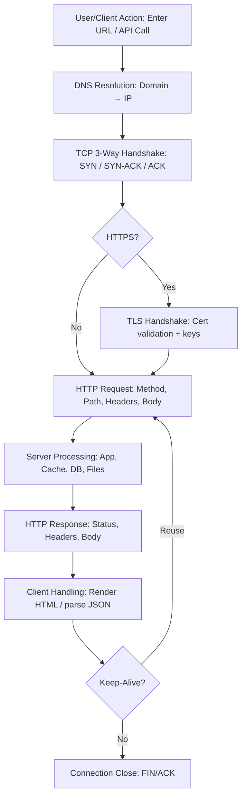

# Networking

## Topologies

## Star Topology

The main premise of a star topology is that devices are individually connected
via a central networking device such as a switch or hub. This topology is the
most commonly found today because of its reliability and scalability — despite
the cost.

## Bus Topology

This type of connection relies upon a single connection known as a **backbone
cable**. This topology is similar to the leaf of a tree in the sense that
devices (leaves) stem from where the branches are on this cable.

Because all data destined for each device travels along the same cable, it is
quickly prone to becoming slow and bottlenecked if devices within the topology
are simultaneously requesting data. This bottleneck also results in very
difficult troubleshooting because it becomes hard to identify which device is
experiencing issues with all data travelling along the same route.

However, bus topologies are one of the easier and more cost-efficient topologies
to set up because of lower expenses, such as cabling or dedicated networking
equipment used to connect these devices.

## Ring Topology

The ring topology (also known as token topology) boasts some similarities.
Devices such as computers are connected directly to each other to form a loop,
meaning there is little cabling required and less dependence on dedicated
hardware such as within a star topology.

A ring topology works by sending data across the loop until it reaches the
destined device, using other devices along the loop to forward the data.
Interestingly, a device will only send received data from another device in this
topology if it does not have any to send itself. If the device has data to send,
it will send its own first before forwarding others’.

Because there is only one direction for data to travel across this topology, it
is fairly easy to troubleshoot any faults that arise. However, this is a double-
edged sword because it isn't an efficient way for data to travel across a
network, as it may have to visit multiple devices before reaching the intended
device.

---

## Subnet

**Subnetting** is the term given to splitting up a network into smaller,
miniature networks within itself. It’s achieved by splitting up the number of
hosts that can fit within the network, represented by a number called a **subnet
mask** (also represented as four bytes/32 bits, 0–255 per octet).

- Home networks are typically a single subnet (unlikely to need more than ~254
  devices).
- Businesses and offices often require multiple subnets for PCs, printers,
  cameras, sensors, etc.

**Benefits of subnetting include:**

- Efficiency
- Security
- Full control

### Common Address Types (Example: 192.168.1.0/24)

| Type            | Purpose                                                                           | Example         |
| --------------- | --------------------------------------------------------------------------------- | --------------- |
| Network Address | Identifies the network and is used to denote its existence.                       | `192.168.1.0`   |
| Host Address    | Identifies a device on the subnet.                                                | `192.168.1.100` |
| Default Gateway | Special host that can send information to another network (often `.1` or `.254`). | `192.168.1.254` |

---

## ARP (Address Resolution Protocol)

Devices have two identifiers: a **MAC address** and an **IP address**. **ARP**
maps these together and stores the results in a local **cache**.

- **ARP Request**: “Who has IP X.X.X.X? Tell me your MAC.”
- **ARP Reply**: “IP X.X.X.X is at MAC xx:xx:xx:xx:xx:xx.”

---

## DHCP (Dynamic Host Configuration Protocol)

**DHCP** dynamically assigns IP addresses to devices on a network.

1. **DHCP Discover** (client → broadcast): “Is there a DHCP server?”
2. **DHCP Offer** (server → client): “Here’s an IP you can use.”
3. (Followed by Request/Ack in full DORA flow.)

---

## OSI Model

The **OSI (Open Systems Interconnection) model** provides a framework for how
devices send, receive, and interpret data.

## 1. Physical

The physical components of hardware used for networking.

- Ethernet cable

## 2. Data Link

Handles **physical addressing**. Receives a packet from the network layer and
adds the **MAC address** of the receiving endpoint. Network Interface Cards
(NICs) have unique MAC addresses.

- Network Interface Card (NIC)

## 3. Network

Where **routing** and **reassembly** take place. Determines the optimal path for
data. Protocols include OSPF and RIP.

- Routing
- IP Addresses

### Public IP Addresses

Public IPs are globally routable and uniquely identify devices on the Internet.
[Public IP Addresses](<https://www.geeksforgeeks.org/computer-networks/what-is->
public-ip-address)

### Private IP Addresses (RFC1918)

- `10.0.0.0/8` → `10.0.0.0 – 10.255.255.255`
- `172.16.0.0/12` → `172.16.0.0 – 172.31.255.255`
- `192.168.0.0/16` → `192.168.0.0 – 192.168.255.255`

Private IPs are non-routable on the Internet and used within local networks.
[Private IP Addresses](<https://www.geeksforgeeks.org/computer-networks/private->
ip-addresses-in-networking/)

## 4. Transport

When data is sent between devices, it follows one of two protocols: **TCP** or
**UDP**.

### TCP

**Features:**

- Sequencing (numbers each segment)
- Flow control
- Error control
- Congestion awareness

**Applications:**

- Web (WWW)
- Email (SMTP, IMAP/POP via TCP)
- FTP
- SSH
- Some streaming services

**Advantages:**

- Reliable connection
- Ordered delivery
- OS-agnostic operation
- Supports many routing protocols
- Adapts to receiver speed

**Disadvantages:**

- Slower than UDP; more overhead
- Slower start (handshake)
- No native multicast/broadcast
- Sensitive to missing data (head-of-line blocking)

### UDP

**Features:**

- Connectionless, low-overhead
- Suitable for multicast
- Used by some routing protocols (e.g., RIP)
- Good for real-time apps

**Applications:**

- Real-time multimedia streaming
- Online gaming
- DNS queries
- Network monitoring
- Multicasting
- Routing updates

**Advantages:**

- No connection setup
- Broadcast/multicast support
- Works across many networks
- Real-time friendly
- Tolerates partial data

**Disadvantages:**

- No delivery acknowledgment
- No sequencing
- Unreliable by design
- Routers may drop on collision/error

## 5. Session

Creates and maintains connections (sessions). Can include **checkpoints** for
efficient recovery and is responsible for closing idle/lost connections.

- Connection checking

## 6. Presentation

Provides **standardization and translation** between application data formats.

- Translator

## 7. Application

Defines the protocols and rules users/applications interact with.

- Data interaction

---

## Headers and Messages

- **Packet** (Layer 3): IP header + payload.
- **Frame** (Layer 2): Encapsulates packet and adds MAC addresses.

**Notable headers:**

| Header             | Description                                          |
| ------------------ | ---------------------------------------------------- |
| Time to Live (TTL) | Sets an expiry to prevent infinite looping/clogging. |
| Checksum           | Integrity checking (e.g., TCP/IP).                   |
| Source Address     | IP of sending device.                                |
| Destination Addr.  | IP of receiving device.                              |

> **Packet** → has IP address info **Frame** → does **not** have IP address info
> (uses MAC)

---

## TCP/IP Model

A summarized 4-layer model of OSI:

- Application
- Transport
- Internet
- Network Interface

**TCP is connection-based** and uses a handshake:

| Step | Message | Description                                    |
| ---- | ------- | ---------------------------------------------- |
| 1    | SYN     | Client initiates connection & synchronization. |
| 2    | SYN/ACK | Server acknowledges synchronization.           |
| 3    | ACK     | Acknowledge receipt of previous messages.      |
| 4    | DATA    | Exchange application data.                     |
| 5    | FIN     | Cleanly close the connection.                  |
| 6    | RST     | Abruptly terminate due to error/problem.       |

**UDP** is stateless and does not perform the three-way handshake.

---

## Port Forwarding

If the administrator wants a website accessible to the public (Internet), they
must implement **port forwarding** on the router.

- **Port forwarding** opens specific ports.
- **Firewalls** determine if traffic may traverse those ports.

---

## Firewall

A firewall decides what traffic is allowed to enter/exit a network.

- Source (where traffic comes from)
- Destination (where traffic goes)
- Port (e.g., allow 80 only?)
- Protocol (UDP/TCP/both?)

Firewalls perform **packet inspection** to determine policy matches.

## Stateful

- Inspects entire connection context (dynamic decisions).
- Heavier resource use; can block an entire device after bad behavior.

## Stateless

- Uses static rules per packet (lighter but “dumber”).
- Great against large traffic from many hosts (e.g., some DDoS scenarios).

---

## VPN

A **Virtual Private Network** allows devices on separate networks to communicate
securely by creating a **tunnel** over the Internet.

| VPN Tech | Description                                                                            |
| -------- | -------------------------------------------------------------------------------------- |
| PPP      | Used by PPTP for authentication and encryption; uses key/cert. Not routable by itself. |
| PPTP     | Allows PPP data to travel outside the network. Easy to set up; weaker encryption.      |
| IPsec    | Encrypts at IP layer. Strong encryption; harder to set up; widely supported.           |

---

## Router

A router connects networks and passes data between them using **routing**.

---

## DNS

## TLD (Top-Level Domain)

The rightmost part (e.g., `tryhackme.com` → `.com`). Two types: **gTLD** and
**ccTLD**.

## Second-Level Domain

`tryhackme` in `tryhackme.com`. Limited to 63 characters, `a–z`, `0–9`, and
hyphens (cannot start/end with hyphens or have consecutive hyphens).

## Subdomains

Left of the SLD (e.g., `admin.tryhackme.com`). Same creation rules and limits
(63 chars each label, total FQDN ≤ 253 chars). Unlimited count.

## DNS Types

- **A Record** → IPv4 (e.g., `104.26.10.229`)
- **AAAA Record** → IPv6 (e.g., `2606:4700:20::681a:be5`)
- **CNAME Record** → Alias to another domain (e.g., `store.tryhackme.com` →
  `shops.shopify.com`)
- **MX Record** → Mail exchangers (with priority)
- **TXT Record** → Free-form text (SPF, ownership verification)
- **TTL** → Cache lifetime

## Recursive DNS Server

Usually provided by your ISP (or a custom choice). Uses a local cache; returns
cached results when available.

## Authoritative Server

Holds the official records for a domain and where DNS updates are made.

---

## HTTP

**HTTP** is used whenever you view a website. It defines the rules for
communicating with web servers (HTML, images, video, etc.).

## HTTPS

**HTTPS** is HTTP over TLS/SSL, providing confidentiality and integrity in
transit.

---

## URL Schema

**URL (Uniform Resource Locator)** instructs how to access a resource:

- **Scheme**: Protocol (`http`, `https`, `ftp`, …)
- **User**: Optional user/pass for services requiring auth
- **Host**: Domain or IP
- **Port**: Typically `80` (HTTP) or `443` (HTTPS), but can be 1–65535
- **Path**: File/location of resource
- **Query**: Extra info (e.g., `/blog?id=1`)
- **Fragment**: Reference to a location on the page

---

## Headers

## Request Example (lines)

1. Method & path & HTTP version (e.g., `GET / HTTP/1.1`)
2. `Host: tryhackme.com`
3. `User-Agent: Firefox/87`
4. `Referer: https://tryhackme.com`
5. _(Blank line ends the request)_

## Response Example (lines)

1. Status line (e.g., `HTTP/1.1 200 OK`)
2. Server software/version
3. Date/time/timezone
4. `Content-Type`
5. `Content-Length`
6. _(Blank line ends the headers)_ 7–… Response body (HTML, etc.)

## Client Headers (common)

- `Host`
- `User-Agent`
- `Content-Length`
- `Accept-Encoding`
- `Cookie`

## Common Response Headers

- `Set-Cookie`
- `Cache-Control`
- `Content-Type`
- `Content-Encoding`

---

## Website Components

Two major components:

- **Front End (Client-Side)** — how the browser renders a site
- **Back End (Server-Side)** — processes requests and returns responses

Core technologies:

- **HTML** — structure
- **CSS** — styling
- **JavaScript** — interactivity

**Sensitive Data Exposure** can occur when a site improperly exposes clear-text
data in frontend source code.

**HTML Injection** occurs when unfiltered user input is rendered on a page,
allowing injected HTML (or JavaScript) to affect appearance/functionality.

---

## CIDR

**CIDR** extends IPv4 longevity and improves allocation by using prefixes (slash
notation), e.g., `192.168.1.0/24` (first 24 bits are network, remaining 8 bits
host). Enables right-sized blocks instead of class-based allocations.

---

## ICMP

**ICMP** is a network-layer protocol for diagnosing communication issues (e.g.,
reachability and error messages). ICMP packets include an ICMP header following
the IP header; error messages include a copy of the offending packet’s IP
header.

---

## DNS Records (Zone Files)

Instructions on authoritative servers defining how to handle a domain (targets,
TTLs). Written in DNS syntax; each record has a **TTL** indicating refresh
frequency.

---

## HTTP Lifecycle

## The Lifecycle of an HTTP Network Request

> **Mnemonic:** **Find the place, knock on the door, show your ID, place your
> order, chef cooks, meal served, you eat, then leave.** **DNS → TCP → TLS →
> Request → Server → Response → Render → Close**

### Quick Map (Restaurant Analogy)

| Step | Network Action            | Analogy           |
| ---- | ------------------------- | ----------------- |
| 1    | DNS Resolution            | Find the place    |
| 2    | TCP Handshake             | Knock on the door |
| 3    | TLS/SSL Handshake (HTTPS) | Show your ID      |
| 4    | HTTP Request              | Place your order  |
| 5    | Server Processing         | Chef cooks        |
| 6    | HTTP Response             | Meal served       |
| 7    | Client Rendering/Handling | You eat           |
| 8    | Connection Reuse/Close    | Then leave        |

### Flow Diagram (Mermaid)

### References

- [Web Requests Explained (Medium)](https://medium.com/@arpit_4999/web-requests-explained-what-happens-when-you-visit-a-website-ff35624bac9b)
- [Demystifying the Journey of a Web Request (Medium)](https://medium.com/@rukhsarkhan4198/demystifying-the-journey-of-a-web-request-from-browser-to-server-and-beyond-f8a706a847c5)
- [Step-by-step Journey of a Network Request (dev.to)](https://dev.to/ashevelyov/the-step-by-step-journey-of-a-network-request-1d10)
- [HTTP Request Lifecycle (furkanbaytekin.dev)](https://www.furkanbaytekin.dev/blogs/software/the-http-request-lifecycle-what-happens-from-browser-to-server)
- [How Does Browser Work in 2019 (Medium)](https://cabulous.medium.com/how-does-browser-work-in-2019-part-ii-navigation-342b27e56d7b)
