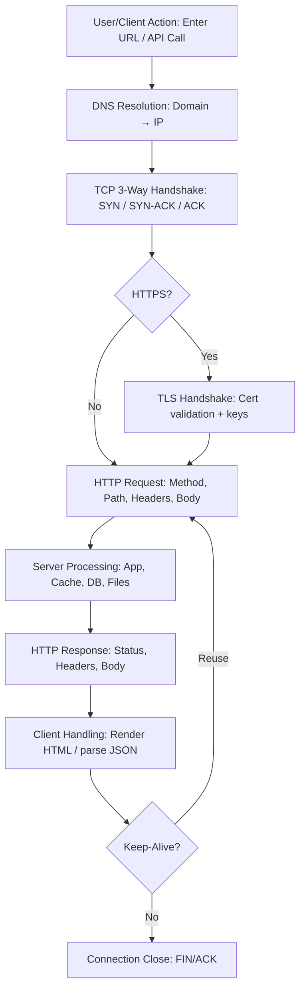

# Topologies

Star Topology
The main premise of a star topology is that devices are individually connected via a central networking device such as a switch or hub. This topology is the most commonly found today because of its reliability and scalability - despite the cost.

## Bus Topology

This type of connection relies upon a single connection which is known as a backbone cable. This type of topology is similar to the leaf off of a tree in the sense that devices (leaves) stem from where the branches are on this cable.

Because all data destined for each device travels along the same cable, it is very quickly prone to becoming slow and bottlenecked if devices within the topology are simultaneously requesting data. This bottleneck also results in very difficult troubleshooting because it quickly becomes difficult to identify which device is experiencing issues with data all travelling along the same route.

However, with this said, bus topologies are one of the easier and more cost-efficient topologies to set up because of their expenses, such as cabling or dedicated networking equipment used to connect these devices.

## Ring Topology

The ring topology (also known as token topology) boasts some similarities. Devices such as computers are connected directly to each other to form a loop, meaning that there is little cabling required and less dependence on dedicated hardware such as within a star topology.

A ring topology works by sending data across the loop until it reaches the destined device, using other devices along the loop to forward the data. Interestingly, a device will only send received data from another device in this topology if it does not have any to send itself. If the device happens to have data to send, it will send its own data first before sending data from another device.

Because there is only one direction for data to travel across this topology, it is fairly easy to troubleshoot any faults that arise. However, this is a double-edged sword because it isn't an efficient way of data travelling across a network, as it may have to visit many multiple devices first before reaching the intended device.

## Subnet

Subnetting is the term given to splitting up a network into smaller, miniature networks within itself.

 Subnetting is achieved by splitting up the number of hosts that can fit within the network, represented by a number called a subnet mask.

A subnet mask which is also represented as a number of four bytes (32 bits), ranging from 0 to 255 (0-255).

 Now, in small networks such as at home, you will be on one subnet as there is an unlikely chance that you need more than 254 devices connected at one time.

However, places such as businesses and offices will have much more of these devices (PCs, printers, cameras and sensors), where subnetting takes place.

Subnetting provides a range of benefits, including:

Efficiency
Security
Full control

Type Purpose Explanation Example
Network Address
This address identifies the start of the actual network and is used to identify a network's existence.
For example, a device with the IP address of 192.168.1.100 will be on the network identified by 192.168.1.0
192.168.1.0
Host Address
An IP address here is used to identify a device on the subnet
For example, a device will have the network address of 192.168.1.1
192.168.1.100
Default Gateway
The default gateway address is a special address assigned to a device on the network that is capable of sending information to another network
Any data that needs to go to a device that isn't on the same network (i.e. isn't on 192.168.1.0) will be sent to this device. These devices can use any host address but usually use either the first or last host address in a network (.1 or .254)
192.168.1.254

Recalling from our previous tasks that devices can have two identifiers: A MAC address and an IP address, the Address Resolution Protocol or ARP for short, is the technology that is responsible for allowing devices to identify themselves on a network.

Each device within a network has a ledger to store information on, which is called a cache. In the context of ARP, this cache stores the identifiers of other devices on the network.

In order to map these two identifiers together (IP address and MAC address), ARP sends two types of messages:

ARP Request
ARP Reply

IP addresses can be assigned either manually, by entering them physically into a device, or automatically and most commonly by using a DHCP (Dynamic Host Configuration Protocol) server. When a device connects to a network, if it has not already been manually assigned an IP address, it sends out a request (DHCP Discover) to see if any DHCP servers are on the network. The DHCP server then replies back with an IP address the device could use (DHCP Offer).

The OSI model (or Open Systems Interconnection Model) is an essential model used in networking.  This critical model provides a framework dictating how all networked devices will send, receive and interpret data.

## Physical

The physical components of hardware used for networking

- Ethernet Cable

## Data Link

 focuses on the physical addressing of the transmission. It receives a packet from the network layer (including the IP address for the remote computer) and adds in the physical MAC (Media Access Control) address of the receiving endpoint. Inside every network-enabled computer is a Network Interface Card (NIC) which comes with a unique MAC address to identify it.

- Network Interface Card

## Network

 where the magic of routing & re-assembly of data takes place (from these small chunks to the larger chunk). Firstly, routing simply determines the most optimal path in which these chunks of data should be sent.

Whilst some protocols at this layer determine exactly what is the "optimal" path that data should take to reach a device, we should only know about their existence at this stage of the networking module. Briefly, these protocols include OSPF (Open Shortest Path First) and RIP (Routing Information Protocol).

- Routing

- IP Addresses

## Transport

When data is sent between devices, it follows one of two different protocols that are decided based upon several factors:

TCP
UDP

- TCP
- UDP

## Session

 the session layer (layer 5) will begin to create and maintain the connection to other computer for which the data is destined. When a connection is established, a session is created. Whilst this connection is active, so is the session.

The session layer is also responsible for closing the connection if it hasn't been used in a while or if it is lost. Additionally, a session can contain "checkpoints," where if the data is lost, only the newest pieces of data are required to be sent, saving bandwidth.

- Connection Checking

## Presentation

Layer 6 of the OSI model is the layer in which standardisation starts to take place. Because software developers can develop any software such as an email client differently, the data still needs to be handled in the same way — no matter how the software works.

This layer acts as a translator for data to and from the application layer (layer 7).

- Translator

## Application

The application layer of the OSI model is the layer that you will be most familiar with. This familiarity is because the application layer is the layer in which protocols and rules are in place to determine how the user should interact with data sent or received.

- Data Interaction

## Headers and Messages

A packet is a piece of data from Layer 3 (Network Layer) of the OSI model, containing information such as an IP header and payload. A frame, however, is used at Layer 2 (Data Link) of the OSI model, which, encapsulates the packet and adds additional information such as MAC addresses.

Some notable headers include:

Header Description
Time to Live This field sets an expiry timer for the packet to not clog up your network if it never manages to reach a host or escape!
Checksum This field provides integrity checking for protocols such as TCP/IP. If any data is changed, this value will be different from what was expected and therefore corrupt.
Source Address The IP address of the device that the packet is being sent from so that data knows where to return to.
Destination Address The device's IP address the packet is being sent to so that data knows where to travel next.

Packet = Does Have IP Address information
Frame = Does Not Have IP Address information

The TCP/IP protocol consists of four layers and is arguably just a summarised version of the OSI model. These layers are:

Application
Transport
Internet
Network Interface

One defining feature of TCP is that it is connection-based, which means that TCP must establish a connection between both a client and a device acting as a server before data is sent.

Step Message Description
1 SYN A SYN message is the initial packet sent by a client during the handshake. This packet is used to initiate a connection and synchronise the two devices together (we'll explain this further later on).
2 SYN/ACK This packet is sent by the receiving device (server) to acknowledge the synchronisation attempt from the client.
3 ACK The acknowledgement packet can be used by either the client or server to acknowledge that a series of messages/packets have been successfully received.
4 DATA Once a connection has been established, data (such as bytes of a file) is sent via the "DATA" message.
5 FIN This packet is used to cleanly (properly) close the connection after it has been complete.
6   RST This packet abruptly ends all communication. This is the last resort and indicates there was some problem during the process. For example, if the service or application is not working correctly, or the system has faults such as low resources.

 UDP is a stateless protocol that doesn't require a constant connection between the two devices for data to be sent. For example, the Three-way handshake does not occur, nor is there any synchronisation between the two devices.

## Port Forwarding

If the administrator wanted the website to be accessible to the public (using the Internet), they would have to implement port forwarding.

t port forwarding opens specific ports (recall how packets work). In comparison, firewalls determine if traffic can travel across these ports (even if these ports are open by port forwarding).

Port forwarding is configured at the router of a network.

## Firewall

A firewall is a device within a network responsible for determining what traffic is allowed to enter and exit.

- Where the traffic is coming from? (has the firewall been told to accept/deny traffic from a specific network?)

- Where is the traffic going to? (has the firewall been told to accept/deny traffic destined for a specific network?)
What port is the traffic for? (has the firewall been told to accept/deny traffic destined for port 80 only?)

- What protocol is the traffic using? (has the firewall been told to accept/deny traffic that is UDP, TCP or both?)

Firewalls perform packet inspection to determine the answers to these questions.

## Stateful

This type of firewall uses the entire information from a connection; rather than inspecting an individual packet, this firewall determines the behaviour of a device based upon the entire connection.

This firewall type consumes many resources in comparison to stateless firewalls as the decision making is dynamic. For example, a firewall could allow the first parts of a TCP handshake that would later fail.

If a connection from a host is bad, it will block the entire device.

## Stateless

This firewall type uses a static set of rules to determine whether or not individual packets are acceptable or not. For example, a device sending a bad packet will not necessarily mean that the entire device is then blocked.

Whilst these firewalls use much fewer resources than alternatives, they are much dumber. For example, these firewalls are only effective as the rules that are defined within them. If a rule is not exactly matched, it is effectively useless.

However, these firewalls are great when receiving large amounts of traffic from a set of hosts (such as a Distributed Denial-of-Service attack)

## VPN

A Virtual Private Network (or VPN for short) is a technology that allows devices on separate networks to communicate securely by creating a dedicated path between each other over the Internet (known as a tunnel). Devices connected within this tunnel form their own private network.

For example, only devices within the same network (such as within a business) can directly communicate. However, a VPN allows two offices to be connected.

VPN Technology Description

PPP
This technology is used by PPTP (explained below) to allow for authentication and provide encryption of data. VPNs work by using a private key and public certificate (similar to SSH). A private key & certificate must match for you to connect.

This technology is not capable of leaving a network by itself (non-routable).

PPTP
The Point-to-Point Tunneling Protocol (PPTP) is the technology that allows the data from PPP to travel and leave a network.

PPTP is very easy to set up and is supported by most devices. It is, however, weakly encrypted in comparison to alternatives.

IPSec
Internet Protocol Security (IPsec) encrypts data using the existing Internet Protocol (IP) framework.

IPSec is difficult to set up in comparison to alternatives; however, if successful, it boasts strong encryption and is also supported on many devices.

## Router

It's a router's job to connect networks and pass data between them. It does this by using routing (hence the name router!).

Routing is the label given to the process of data travelling across networks.

## DNS

Domain Name System

## TLD (Top Level Domain)

A TLD is the most righthand part of a domain name. So, for example, the tryhackme.com TLD is .com.

There are two types of TLD, gTLD (Generic Top Level) and ccTLD (Country Code Top Level Domain).

## Second-Level Domain

Taking tryhackme.com as an example, the .com part is the TLD, and tryhackme is the Second Level Domain. When registering a domain name, the second-level domain is limited to 63 characters + the TLD and can only use a-z 0-9 and hyphens (cannot start or end with hyphens or have consecutive hyphens).

## Subdomains

A subdomain sits on the left-hand side of the Second-Level Domain using a period to separate it; for example, in the name admin.tryhackme.com the admin part is the subdomain. A subdomain name has the same creation restrictions as a Second-Level Domain, being limited to 63 characters and can only use a-z 0-9 and hyphens (cannot start or end with hyphens or have consecutive hyphens). You can use multiple subdomains split with periods to create longer names, such as jupiter.servers.tryhackme.com. But the length must be kept to 253 characters or less. There is no limit to the number of subdomains you can create for your domain name.

## DNS Types

### A Record

These records resolve to IPv4 addresses, for example 104.26.10.229

### AAAA Record

These records resolve to IPv6 addresses, for example 2606:4700:20::681a:be5

### CNAME Record

These records resolve to another domain name, for example, TryHackMe's online shop has the subdomain name store.tryhackme.com which returns a CNAME record shops.shopify.com. Another DNS request would then be made to shops.shopify.com to work out the IP address.

### MX Record

These records resolve to the address of the servers that handle the email for the domain you are querying, for example an MX record response for tryhackme.com would look something like alt1.aspmx.l.google.com. These records also come with a priority flag. This tells the client in which order to try the servers, this is perfect for if the main server goes down and email needs to be sent to a backup server.

### TXT Record

TXT records are free text fields where any text-based data can be stored. TXT records have multiple uses, but some common ones can be to list servers that have the authority to send an email on behalf of the domain (this can help in the battle against spam and spoofed email). They can also be used to verify ownership of the domain name when signing up for third party services.

### TTL

Time To Live specifies how long a DNS record should be cached for.

## Recursive DNS Server

A Recursive DNS Server is usually provided by your ISP, but you can also choose your own. This server also has a local cache of recently looked up domain names. If a result is found locally, this is sent back to your computer

## Authoritative Server

An authoritative DNS server is the server that is responsible for storing the DNS records for a particular domain name and where any updates to your domain name DNS records would be made.

## HTTP

HTTP is what's used whenever you view a website, developed by Tim Berners-Lee and his team between 1989-1991. HTTP is the set of rules used for communicating with web servers for the transmitting of webpage data, whether that is HTML, Images, Videos, etc.

## HTTPS

HTTP is what's used whenever you view a website, developed by Tim Berners-Lee and his team between 1989-1991. HTTP is the set of rules used for communicating with web servers for the transmitting of webpage data, whether that is HTML, Images, Videos, etc.

## URL Schema

What is a URL? (Uniform Resource Locator)

If you’ve used the internet, you’ve used a URL before. A URL is predominantly an instruction on how to access a resource on the internet

Scheme: This instructs on what protocol to use for accessing the resource such as HTTP, HTTPS, FTP (File Transfer Protocol).

User: Some services require authentication to log in, you can put a username and password into the URL to log in.

Host: The domain name or IP address of the server you wish to access.

Port: The Port that you are going to connect to, usually 80 for HTTP and 443 for HTTPS, but this can be hosted on any port between 1 - 65535.

Path: The file name or location of the resource you are trying to access.

Query String: Extra bits of information that can be sent to the requested path. For example, /blog?id=1 would tell the blog path that you wish to receive the blog article with the id of 1.

Fragment: This is a reference to a location on the actual page requested. This is commonly used for pages with long content and can have a certain part of the page directly linked to it, so it is viewable to the user as soon as they access the page.

## Headers

Line 1: This request is sending the GET method ( more on this in the HTTP Methods task ), request the home page with / and telling the web server we are using HTTP protocol version 1.1.

Line 2: We tell the web server we want the website tryhackme.com

Line 3: We tell the web server we are using the Firefox version 87 Browser

Line 4: We are telling the web server that the web page that referred us to this one is <https://tryhackme.com>

Line 5: HTTP requests always end with a blank line to inform the web server that the request has finished.

## Response

Line 1: HTTP 1.1 is the version of the HTTP protocol the server is using and then followed by the HTTP Status Code in this case "200 OK" which tells us the request has completed successfully.

Line 2: This tells us the web server software and version number.

Line 3: The current date, time and timezone of the web server.

Line 4: The Content-Type header tells the client what sort of information is going to be sent, such as HTML, images, videos, pdf, XML.

Line 5: Content-Length tells the client how long the response is, this way we can confirm no data is missing.

Line 6: HTTP response contains a blank line to confirm the end of the HTTP response.

Lines 7-14: The information that has been requested, in this instance the homepage.

## Requests

HTTP methods are a way for the client to show their intended action when making an HTTP request. There are a lot of HTTP methods but we'll cover the most common ones, although mostly you'll deal with the GET and POST method.

GET Request

This is used for getting information from a web server.

POST Request

This is used for submitting data to the web server and potentially creating new records

PUT Request

This is used for submitting data to a web server to update information

DELETE Request

This is used for deleting information/records from a web server.

## Status Codes

100-199 - Information Response These are sent to tell the client the first part of their request has been accepted and they should continue sending the rest of their request. These codes are no longer very common.
200-299 - Success This range of status codes is used to tell the client their request was successful.
300-399 - Redirection These are used to redirect the client's request to another resource. This can be either to a different webpage or a different website altogether.
400-499 - Client Errors Used to inform the client that there was an error with their request.
500-599 - Server Errors This is reserved for errors happening on the server-side and usually indicate quite a major problem with the server handling the request.

200 - OK The request was completed successfully.
201 - Created A resource has been created (for example a new user or new blog post).
301 - Moved Permanently This redirects the client's browser to a new webpage or tells search engines that the page has moved somewhere else and to look there instead.
302 - Found Similar to the above permanent redirect, but as the name suggests, this is only a temporary change and it may change again in the near future.
400 - Bad Request This tells the browser that something was either wrong or missing in their request. This could sometimes be used if the web server resource that is being requested expected a certain parameter that the client didn't send.
401 - Not Authorised You are not currently allowed to view this resource until you have authorised with the web application, most commonly with a username and password.
403 - Forbidden You do not have permission to view this resource whether you are logged in or not.
405 - Method Not Allowed The resource does not allow this method request, for example, you send a GET request to the resource /create-account when it was expecting a POST request instead.
404 - Page Not Found The page/resource you requested does not exist.
500 - Internal Service Error The server has encountered some kind of error with your request that it doesn't know how to handle properly.
503 - Service Unavailable
This server cannot handle your request as it's either overloaded or down for maintenance.

## Client Headers

These are headers that are sent from the client (usually your browser) to the server.

Host: Some web servers host multiple websites so by providing the host headers you can tell it which one you require, otherwise you'll just receive the default website for the server.

User-Agent: This is your browser software and version number, telling the web server your browser software helps it format the website properly for your browser and also some elements of HTML, JavaScript and CSS are only available in certain browsers.

Content-Length: When sending data to a web server such as in a form, the content length tells the web server how much data to expect in the web request. This way the server can ensure it isn't missing any data.

Accept-Encoding: Tells the web server what types of compression methods the browser supports so the data can be made smaller for transmitting over the internet.

Cookie: Data sent to the server to help remember your information (see cookies task for more information).
Common Response Headers

These are the headers that are returned to the client from the server after a request.

Set-Cookie: Information to store which gets sent back to the web server on each request (see cookies task for more information).

Cache-Control: How long to store the content of the response in the browser's cache before it requests it again.

Content-Type: This tells the client what type of data is being returned, i.e., HTML, CSS, JavaScript, Images, PDF, Video, etc. Using the content-type header the browser then knows how to process the data.

Content-Encoding: What method has been used to compress the data to make it smaller when sending it over the internet.

## Website Components

There are two major components that make up a website:

Front End (Client-Side) - the way your browser renders a website.
Back End (Server-Side) - a server that processes your request and returns a response.

Websites are primarily created using:

HTML, to build websites and define their structure
CSS, to make websites look pretty by adding styling options
JavaScript, implement complex features on pages using interactivity.

JavaScript (JS) is one of the most popular coding languages in the world and allows pages to become interactive. HTML is used to create the website structure and content, while JavaScript is used to control the functionality of web pages

Sensitive Data Exposure occurs when a website doesn't properly protect (or remove) sensitive clear-text information to the end-user; usually found in a site's frontend source code.

We now know that websites are built using many HTML elements (tags), all of which we can see simply by "viewing the page source".

HTML Injection is a vulnerability that occurs when unfiltered user input is displayed on the page. If a website fails to sanitise user input (filter any "malicious" text that a user inputs into a website), and that input is used on the page, an attacker can inject HTML code into a vulnerable website.

When a user has control of how their input is displayed, they can submit HTML (or JavaScript) code, and the browser will use it on the page, allowing the user to control the page's appearance and functionality.

## HTTP Lifecycle

### The Lifecycle of an HTTP Network Request

> **Mnemonic:** “**Find the place, knock on the door, show your ID, place your order, chef cooks, meal served, you eat, then leave.**”  
> DNS → TCP → TLS → Request → Server → Response → Render → Close

---

## 📌 Why it matters

Understanding this flow helps you debug APIs, read network logs, harden security, and optimize performance.

---

## 🧠 Quick Map (Restaurant Analogy)

| Step | Network Action | Analogy |
|---|---|---|
| 1 | DNS Resolution | Find the place |
| 2 | TCP Handshake | Knock on the door |
| 3 | TLS/SSL Handshake (HTTPS) | Show your ID |
| 4 | HTTP Request | Place your order |
| 5 | Server Processing | Chef cooks |
| 6 | HTTP Response | Meal served |
| 7 | Client Rendering/Handling | You eat |
| 8 | Connection Reuse/Close | Then leave |

---

## 🗺️ Flow Diagram (Mermaid)

## References

[Web Requests Explained (Medium)](https://medium.com/@arpit_4999/web-requests-explained-what-happens-when-you-visit-a-website-ff35624bac9b)

[Demystifying the Journey of a Web Request (Medium)](https://medium.com/@rukhsarkhan4198/demystifying-the-journey-of-a-web-request-from-browser-to-server-and-beyond-f8a706a847c5)

[Step-by-step Journey of a Network Request (dev.to)](https://dev.to/ashevelyov/the-step-by-step-journey-of-a-network-request-1d10)

[HTTP Request Lifecycle (furkanbaytekin.dev)](https://www.furkanbaytekin.dev/blogs/software/the-http-request-lifecycle-what-happens-from-browser-to-server)

[How Does Browser Work in 2019 (cabulous.medium.com)](https://cabulous.medium.com/how-does-browser-work-in-2019-part-ii-navigation-342b27e56d7b)

## Learning Objectives

- Learn about HTML Injection more.

